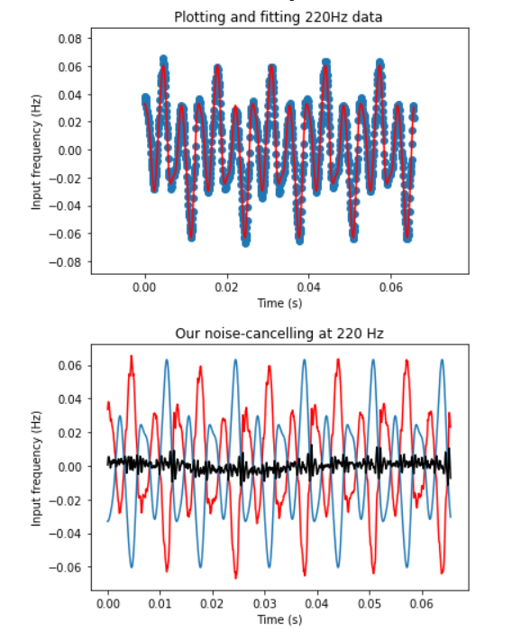

# Noise Cancelling Headphones

This project uses Python to demonstrate the principle of active noise cancellation, or using Fourier transforms to reduce the amplitude of a signal. We compared our results to a set of Bose headphones that use active noise cancellation and found that our code was able to achieve similar results. 
